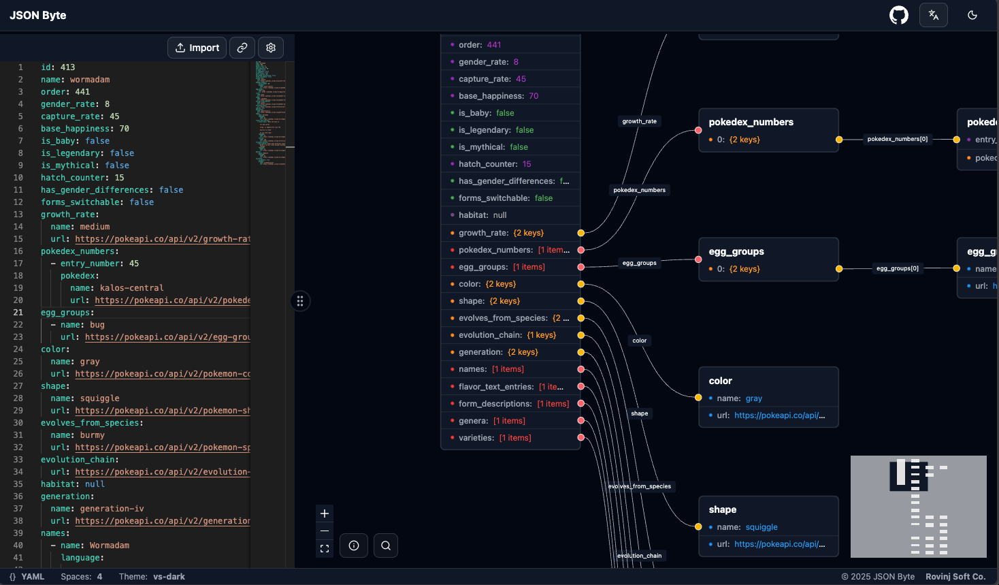
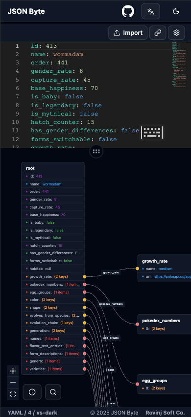

# JSON Byte

**JSON Byte** is a tool that visualizes the structure of your **JSON** or **YAML** data as an intuitive **graph view**.  
It helps you quickly explore deeply nested objects and arrays, and understand key/value relationships at a glance.


## Screenshot

### Desktop Browser Example

<p align="center">
  
</p>

### Mobile Browser Example

<p align="center">
  
</p>

---

## Core Values

- **Instant Understanding**: Expand nested structures as nodes and edges for clear data visualization  
- **Bidirectional View**: Text editor and graph view stay synchronized in real time  
- **Mobile Support**: Works seamlessly on mobile browsers  
- **YAML Support**: Full YAML document parsing  
- **File Upload**: Import JSON or YAML files directly for analysis  
- **Sharing**: Share JSON data through a simple URL without going through any server  
- **Privacy & Security**: Runs entirely in your browser — no data is sent or stored on any server  

---

## Main Features

- **Input Formats**: `JSON`, `YAML` (multi-document YAML supported)
- **Visualization**
  - Objects and arrays are represented as nodes, with keys or indexes shown as edge labels  
  - Data types (string, number, boolean, null, object, array) are color-coded for clarity  
- **Synchronized Editing**
  - The text editor and the graph are **synchronized in real time**
  - Parsing errors are highlighted instantly in the editor  
- **Search & Navigation**
  - **Keyword Search (⌘/Ctrl + K)** — quickly find and jump to any node  
- **View Options**
  - Dark/Light mode  
  - Adjustable editor theme and indentation  
- **Accessibility & Internationalization**
  - Supports multiple languages (currently Korean and English)  
- **Privacy**
  - All operations are performed **locally** (no network transmission)

---

## Quick Start

### 1) Use on the Web

1. Visit <https://json-byte.pages.dev>  
2. Paste your `JSON` or `YAML` content into the editor on the left  
3. Explore the data structure in the graph view below or on the right  

---

## Example Usage

### JSON Input

```json
{
  "firstName": "John",
  "lastName": "Doe",
  "age": 26,
  "work": true,
  "address": {
    "streetAddress": "naist street",
    "city": "Nara",
    "postalCode": "630-0192"
  },
  "phoneNumbers": [
    { "type": "home", "number": "0123-4567" },
    { "type": "office", "number": "9876-5432" }
  ]
}
```

### In the Graph View

- Click a node → Focus and center on that node  
- Search nodes → Use names or JSONPath expressions to find them  

---

## Limitations

- Very large JSON data (hundreds of thousands of nodes) may cause performance issues due to browser memory and rendering limits  
- YAML anchors, aliases, and custom tags are partially supported  
- Comments are removed during export for optimization  

---

## Roadmap

- [ ] **Diff View** — Compare two JSON structures visually  

---

## Issues & Contributions

Bug reports, feature requests, and suggestions are welcome via GitHub Issues.  
Pull Requests are also welcome — please follow the guidelines below.

---

## Local Development

```bash
pnpm i
pnpm dev     # Start development server
pnpm build   # Build for production
pnpm test    # Run tests
```

> Update Node version, package manager, ESLint/Prettier, and Vitest configurations according to your project setup.
